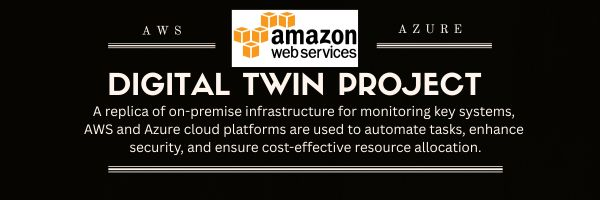

  

  This serves as a PoC for a highly available, monolithic, hybrid data center.
 
 The argument is to advocate for the use of AWS services for non-core infrastructure, when permitted by 
 respective regulatory/compliance requirements. Whilst cloud-native network architectures are
 effective for certain use cases, such network architectures are not feasible for industries which
 require adherance to stringent workflows and documentation.
 
 Digital twins allow for predictive maintenance, provides insights into when and how assets should be
 upgraded or replaced, which adheres to the Cost Optimisation Pillar of the Well-Architected Framework.
 
 <b>Source:</b> Digital Twin Technology: A Game-Changer for Asset Management in the Utilities Industry
 https://www.quinnox.com/blog/digital-twin-technology-a-game-changer-for-asset-management-in-the-utilities-industry/
  
## Table of Contents
  - [Digital twin project for the energy and power industry (PoC). ](#project-title-and-description)
  - [Tech Stack](#tech-stack)
- [Features](#features)
- [Installation](#installation)
- [Usage](#usage)
- [Contributing](#contributing)
- [License](#license)
- [Acknowledgments](#acknowledgments)

 Tech Stack #tech-stack
 
- **Azure**: Virtual Machines (VMs) for **Windows Server 2022**, **pfSense**, **Ubuntu**.
- **AWS**: **CloudWatch**, **Firehose**, **EventBridge**, **Lambda**, **S3**, **DataDog**, **New Relic**.
- **MySQL**: Primary database on **Azure**, backup on **Debian**.
- **VirtualBox**: For local hosting of **Debian** and **Ubuntu** VMs.
 

 <b></b>Features</b>
 - Hybrid cloud architecture using Azure (heavy workloads) and AWS (logging, monitoring).
 - EventBridge for real-time alerts, remediation using Lambda.
 - Compliant with regulations like ISO 27001, SOC 2, GDPR.
 - Cost optimization by outsourcing non-critical infrastructure tasks to the cloud.
 - Digital Twin model for enhanced performance monitoring in the energy sector.
